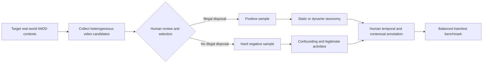

<div align="center">

# Mivia-IWDD-500 Dataset

### A PUBLIC VIDEO BENCHMARK FOR AUTOMATED ILLEGAL WASTE DUMPING DETECTION AND TEMPORAL LOCALIZATION

[](https://doi.org/10.1016/j.imavis.2026.106125)
[](#dataset-at-a-glance)
[](#dataset-at-a-glance)
[](#task-definition)

**Mivia-IWDD-500** is a *fully balanced public video dataset* designed for the **automated detection** and **temporal localization** of illegal waste dumping events in realistic surveillance footage. It comprises **500 videos**, equally divided into **250 positive** and **250 negative** samples. The positive subset is itself balanced between **125 static** and **125 dynamic** disposal events.

</div>

---

## Table of contents

- [Overview](#overview)
- [Task definition](#task-definition)
- [Dataset at a glance](#dataset-at-a-glance)
- [Data collection and sample selection](#data-collection-and-sample-selection)
- [Annotation methodology](#annotation-methodology)
- [Citation](#citation)
- [Authors](#authors)

---

## Overview

Illegal Waste Dumping Detection (IWDD) concerns the automatic recognition of unlawful waste disposal in video streams. The problem is not reducible to the static recognition of garbage objects: a reliable system must interpret the **temporally evolving action** through which an object is abandoned and distinguish it from visually similar but legitimate activities. IWDD can therefore be viewed as a domain-specific video-anomaly and action-recognition problem.

The dataset was introduced to address the lack of a publicly available benchmark specifically designed for video-based IWDD. Existing resources have largely focused on static waste images, material classification, abandoned dumpsites, or private video collections, limiting reproducibility and standardized comparison. Mivia-IWDD-500 provides a public benchmark with a balanced class distribution, heterogeneous surveillance conditions, event-onset annotations, and an official train/test protocol.

## Task definition

The benchmark distinguishes two disposal modalities:

| Modality | Definition | Representative examples | Main detection challenge |
|---|---|---|---|
| **Static disposal** | Intentional deposition of waste at a selected location. The action is generally spatially localized and temporally well defined. | Leaving garbage bags beside a collection point, abandoning furniture, unloading construction debris or bulky materials. | The evidence may unfold across multiple stages, such as approaching, placing the object, and walking away. |
| **Dynamic disposal** | Brief and spontaneous disposal performed while the subject or vehicle is in motion. | Throwing waste from a moving vehicle, dropping litter while walking, releasing a small object in passing. | The event can occur within a fraction of a second and requires sensitivity to subtle temporal and motion cues. |

The benchmark supports two coupled objectives:

1. **Video-level detection:** determine whether an illegal dumping event occurs.
2. **Temporal localization:** estimate the onset timestamp of the dumping event in positive videos.

## Dataset at a glance

| Property | Value |
|---|---:|
| Dataset name | **Mivia-IWDD-500** |
| Total videos | **500** |
| Total footage | **Approximately 3.21 hours** |
| Positive videos | **250** |
| Negative videos | **250** |
| Static disposal videos | **125** |
| Dynamic disposal videos | **125** |
| Daytime videos | **450** |
| Nighttime videos | **50** |
| Bright-condition videos | **472** |
| Dim-condition videos | **28** |
| Official split | **400 training / 100 test** |
| Validation split | **Not specified in the paper** |
| Resolution range | **320×240 to 4096×2160** |
| Most common resolutions | **1920×1080 (45.2%)**, **1280×720 (24.8%)** |
| Typical frame-rate range | **Most videos: 20–30 FPS** |
| Typical clip duration | **The majority are slightly under 20 seconds** |
| Approximate mean duration | **≈23.1 seconds per video**, derived from the reported total duration |

## Data collection and sample selection

The dataset was constructed through a deliberate collection and curation process intended to represent the environments in which automated IWDD systems are likely to operate, including waste collection points, public dumping areas, roadside zones, rural or vegetated locations, and other surveillance contexts.

### Positive samples

The majority of positive videos were collected from **real-world surveillance systems**, including both concealed and openly installed cameras. These recordings capture authentic, unscripted waste-abandonment events under naturally occurring conditions. The collection was designed to preserve the variability typical of operational surveillance footage, including differences in:

- camera angle and field of view;
- illumination and time of day;
- scene complexity, clutter, visibility, and partial occlusion;
- waste type, scale, and appearance;
- subject and vehicle motion;
- spatial and temporal characteristics of the disposal action.

The positive subset covers static actions such as placing boxes, domestic garbage bags, furniture, construction debris, or bulky materials on the ground, as well as dynamic actions such as throwing or dropping waste while walking or from a moving vehicle.

### Negative samples and hard-negative curation

Negative-sample selection was treated as a central part of the benchmark design. Rather than collecting only obviously unrelated activities, the authors deliberately selected **hard negatives** that resemble illegal dumping in appearance, motion, or context. These include:

- subjects appearing to place or drop an object without abandoning it;
- people carrying bags, backpacks, or boxes;
- pedestrians or vehicles moving near waste that was already present when the recording began;
- subjects picking up objects from the ground;
- sanitation workers, garbage trucks, and authorized cleaning operations.

These confounding cases are intended to reduce shortcut learning and false alarms by forcing models to distinguish the act of illegal abandonment from ordinary movement, pre-existing waste, and legitimate waste-management activities.



## Annotation methodology

All annotations were produced by **human annotators**. For every positive video, the annotation records the exact onset of the disposal event and assigns the event to the static or dynamic taxonomy. The ground-truth onset is defined as the **first frame at which the dumping action becomes visible**, following exhaustive review.

Each video also includes contextual labels describing the time of day and illumination condition. The annotation design is weakly temporal: the event onset is annotated, but the paper explicitly states that dense frame-level annotations are not available.

### Semantic annotation components

| Annotation component | Applies to | Domain / representation | Meaning |
|---|---|---|---|
| **Video-level label** | All videos | Binary: dumping / no dumping | Indicates whether the video contains an illegal waste dumping event. |
| **Event-onset timestamp** | Positive videos | Temporal instant, expressed relative to the video timeline | First frame or time instant at which the dumping action becomes visible. |
| **Disposal modality** | Positive videos | `static` or `dynamic` | Distinguishes spatially localized deposition from brief disposal performed in motion. |
| **Time of day** | All videos | `day` or `night` | Describes whether the scene was captured during daytime or nighttime. |
| **Illumination** | All videos | `bright` or `dim` | Describes the prevailing visibility and lighting condition. |

> **Serialization note.** The paper specifies the semantic content of the annotations but does not define the exact on-disk format, filenames, field names, data types, or sentinel values used for negative samples. The public release should therefore include a machine-readable schema or example annotation that matches the distributed files. No undocumented JSON or CSV structure is assumed in this README.


## Citation

When using Mivia-IWDD-500, please cite:

```bibtex
@article{greco2026benchmarking,
  title   = {Benchmarking Illegal Waste Dumping Detection: A Public Video Dataset and a Reference Baseline},
  author  = {Greco, Antonio and Ricciardi, Andrea Vincenzo and Sansone, Carlo and Vento, Bruno},
  journal = {Image and Vision Computing},
  volume  = {174},
  pages   = {106125},
  year    = {2026},
  doi     = {10.1016/j.imavis.2026.106125}
}
```

**Paper:** [https://doi.org/10.1016/j.imavis.2026.106125](https://doi.org/10.1016/j.imavis.2026.106125)

## Authors

- **Antonio Greco** — Department of Information and Electrical Engineering and Applied Mathematics, University of Salerno, Italy
- **Andrea Vincenzo Ricciardi** — Department of Information and Electrical Engineering and Applied Mathematics, University of Salerno, Italy
- **Carlo Sansone** — Department of Electrical Engineering and Information Technology, University of Naples Federico II, Italy
- **Bruno Vento** — Consorzio Interuniversitario Nazionale per l’Informatica (CINI), Italy

All authors contributed equally to the work.

---

<div align="center">

Mivia-IWDD-500 · Public benchmark for reproducible illegal waste dumping detection research

</div>
